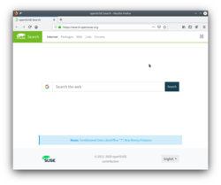
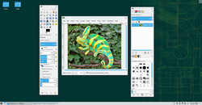

6. Apps for Common Tasks

Here's a list of applications used to perform common tasks, they're all installed by default and are all high quality, but naturally you can replace them with alternatives if you wish.  

<table>
<tbody>
<tr>
<td></td>
<td>All the alternatives mentioned below will be available for easy installation with the <a href="installpackage.php">package manager</a>, if the recommended <a href="repositories.php">software repositories</a> are added (see later chapters).</td>
</tr>
</tbody>
</table>

 

You can find more replacements for your familiar applications here: 
<a href="http://en.opensuse.org/Application_equivalents" target="_blank">http://en.opensuse.org/Application_equivalents</a>  

6.1 Surf the Web with Firefox

Mozilla Firefox is the default web browser. It's one of the world's leading web browsers.  

 

Alternatives to consider: Opera, Chromium, Falkon, Konqueror  

6.2 Office Productivity with LibreOffice

LibreOffice is a complete office suite with word processing, spreadsheets, presentation, drawing and more. It's very compatible with Microsoft Office.  

 

Alternatives to consider: Calligra, Abiword, Gnumeric  

6.3 Play multimedia with VLC

The default installation includes VLC Media Player which plays music and video.  

 

Alternatives to consider for music: Amarok, Elisa, Clementine, JuK, Qmmp 
Alternatives to consider for video: SMPlayer, mpv, Kaffeine, Dragon  

6.4 Image Editing with GIMP

GIMP (GNU Image Manipulation Program) is a very powerful image editing application.  

 

<table>
<tbody>
<tr>
<td></td>
<td>GIMP can work as a single window, simply click 'Windows' in the menu and check the option 'Single-Window Mode'.</td>
</tr>
</tbody>
</table>

 

Alternatives to consider: Gwenview (only very basic editing), Krita (primarily a paint application)  

6.5 E-mail, Calendar, News feeds and more with Kontact

Kontact is a fullblown PIM (personal information management) suite, combining e-mail, calendar, news feeds, addressbook and more in one place. Each of the Kontact components (KMail, KOrganizer, Akregator etc.) can also be used as standalone applications.  

 

Alternatives to consider: Mozilla Thunderbird, Trojita (IMAP only), Claws-mail  
