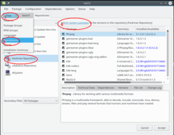

# 13. Multimedia Codecs

This chapter describes two different methods for installing the packages needed to playback most multimedia formats - including MP3, DVDs etc., with the default media player VLC as well as playing online videos in Firefox. You can use manual 1-click installation or use the command line - whichever method you prefer.

By default only free, open, non-patent encumbered formats such as Ogg Theora, Ogg Vorbis and Flac are supported for legal reasons (US software patents and Digital Millennium Copyright Act (DMCA)).

## 13.1 Codec Installation with 1-Click

1) Click on the button below to add the necessary repositories and install the required packages with 1-click install.

<table>
<tbody>
<tr>
<td></td>
<td>These 1-Click Installers currently only work with the <b>Firefox web browser</b>.</td>
</tr>
</tbody>
</table>

<table>
<tbody>
<tr>
<td></td>
<td>If a conflict dialog appears, select to install the packages <b><i>with</i> Vendor Change</b>.</td>
</tr>
</tbody>
</table>

2) Afterwards make sure all your multimedia packages are coming from the Packman Repository:

Start YaST Software Management => Click on View => Click on Repositories => Select the Packman Repository => Click "Switch system packages" => Click "Accept"

## 13.2 Codec Installation in the Terminal

To install codecs using the terminal instead, do these steps:

<table>
<tbody>
<tr>
<td></td>
<td>Use Copy/Paste to avoid typos. To paste in Konsole right click mouse => Paste - or use <b>Ctrl+Shift+V</b>.</td>
</tr>
</tbody>
</table>

1) Add the needed repositories:

zypper addrepo -f http://ftp.gwdg.de/pub/linux/misc/packman/suse/openSUSE_Leap_15.3/ packman

zypper addrepo -f http://opensuse-guide.org/repo/openSUSE_Leap_15.3/ dvd

2) Then install the necessary packages:

zypper install --allow-vendor-change ffmpeg-3 lame gstreamer-plugins-bad gstreamer-plugins-ugly gstreamer-plugins-ugly-orig-addon gstreamer-plugins-libav libavdevice57 libdvdcss2 vlc-codecs

3) Make sure all your multimedia packages are coming from the Packman Repository:

zypper dup --allow-vendor-change --from http://ftp.gwdg.de/pub/linux/misc/packman/suse/openSUSE_Leap_15.3/

