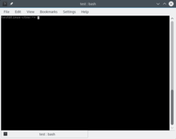

# 8. Terminal

Almost any task can be performed graphically on a modern GNU/Linux distribution such as openSUSE, but to really become a self-reliant user and to truly take advantage of the power of your GNU/Linux operating system, you should at least know a few terminal basics - it's not difficult at all!

There are thousands of commands you can run, each with a number of different options. So this chapter is just a small teaser describing the most common commands.

You'll find <i>Konsole</i> under System in the launch menu.

<video src="video/konsole.ogv" controls>  

<b>Your web browser does not support the HTML5 video element and/or Ogg Theora format. 
Try Firefox, Konqueror or Opera.</b>  

<a href="video/konsole.ogv">Download video for local viewing (4.3 MB)</a>
</video>
  

Using the command line is quite easy. Simply enter a command and possibly one or more options and one or more arguments and then press Enter. Example:

ls -l /home/[username]/ 

The <i>command</i> <b>ls</b> displays a list of files, the <i>option</i> <b>-l</b> means that the list will be displayed in a long listing format, and the <i>argument</i> <b>/home/[username]/</b> sets the directory of which the contents are listed.

## 8.1 Useful Shortcuts

### Tab-key

The tab-key is increcibly useful, if possible it will auto-complete commands and arguments, which helps you work faster and avoid typos.

### Ctrl+Shift+V

Paste from the clipboard.

### Ctrl+C

This shortcut stops any operation you may have started.

## 8.2 Examples of Basic Commands

This is just a very small selection of commands to give you an idea of how things work.

<table>
<tbody>
<tr>
<td></td>
<td>Commands written in <u>red</u> need to be run as root.</td>
</tr>
</tbody>
</table>

### 8.2.1 File Management

Changing directory

cd /home/user/directoryname/

Listing files of a directory

ls

Copying a file

cp filename /home/user/directoryname/filename

Deleting a file

rm filename

Deleting a directory including contents

rm -rf /home/user/directoryname

Moving or renaming a file

mv /home/user/filename /home/user/newfilename

### 8.2.2 System Monitoring

Running processes and consumption of system resources. Press <b>'Q'</b> to exit.

top 

Disk space usage

df

Memory consumption

free

### 8.2.3 Network

Find out your IP-address

ip a

Find out your gateway

ip route

Find out your DNS servers

cat /etc/resolv.conf

### 8.2.4 Man Pages and Help

Almost all commands have an accompanying manual page describing how to use the command and the available options. For example type:

man cp

To leave the man page again press <b>'Q'</b>

If a command does not have a man page, try <i>--help</i> instead, example:

cp --help

### 8.2.5 Becoming Root

To switch to the root user to perform system administration tasks, type:

su -

Then type your (root) password. Nothing will appear on screen as you type, this is intended.

To stop working as root and return to working as your normal user, run <i>exit</i>.

exit

To run a single command as root use:

su -c "[command]"

<table>
<tbody>
<tr>
<td></td>
<td>Do not work as root unless it's required.</td>
</tr>
</tbody>
</table>

### 8.2.6 System Tasks

Shutting down.

systemctl shutdown

Rebooting.

systemctl reboot

Start, stop, restart or get status of system services (start|stop|restart|status). Examples:

systemctl restart network

systemctl stop firewalld

systemctl start apache2

systemctl status smb

Enable or disable a service from starting at every boot. Examples:

systemctl enable sshd

systemctl disable cups

### 8.2.7 The Kernel

Find out your kernel version and flavour.

uname -r

Check kernel messages (useful for troubleshooting hardware issues).

dmesg

Listing loaded kernel modules.

lsmod

Loading a kernel module.

modprobe [modulename]

Unloading a kernel module.

rmmod [modulename]

### 8.2.8 Hardware Information

The command hwinfo can provide you with information about almost any hardware, some examples:

hwinfo --short --wlan

hwinfo --short --gfxcard

List PCI devices:

lspci

List USB devices:

lsusb

## 8.3 Editing Text Files

Editing configuration files or other text files can be done like this using the vim editor, which is installed by default.

Open a file with <i>vim /path/to/file</i>. Example:

vim /etc/sysconfig/yast2

<table>
<tbody>
<tr>
<td></td>
<td>Root permissions are used in the example because <i>yast2</i> is a system configuration file - this is not generally required to edit files with vim.</td>
</tr>
</tbody>
</table>

Press <b>i</b> to enter insert mode (you will see "-- INSERT --" at the bottom). Now you can edit the text in the file. When you're done editing press <b>Esc</b> to leave insert mode and return to command mode. Now type <b>:x</b> which is the command for exit and save. To quit without saving any changes use <b>:q!</b>.

Vim is quite advanced, you might consider installing a simpler text based editor, e.g. try <i>nano</i>.

## 8.4 Further reading

If you want to learn more about using the terminal there are many resources available on the internet, here are a couple of links.

<a href="https://www.guru99.com/unix-linux-tutorial.html" target="_blank">https://www.guru99.com/unix-linux-tutorial.html</a>

<a href="http://linuxcommand.org/" target="_blank">http://linuxcommand.org/</a>

<a href="http://tldp.org/LDP/GNU-Linux-Tools-Summary/html/index.html" target="_blank">http://tldp.org/LDP/GNU-Linux-Tools-Summary/html/index.html</a>
