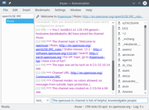

# Appendix A: Help and Docs

This guide is just a brief introduction to some of the basics, so it's likely you're going to need additional help at some point. Nothing beats getting help from a friend face-to-face and on-site, but that's often not an option, so thankfully there are many places where you can get help from openSUSE users online - which method to choose depends on your personal preference.  

<table>
<tbody>
<tr>
<td></td>
<td>Always give detailed problem descriptions, and provide relevant information, such as openSUSE version, desktop environment, relevant hardware components etc., when asking for help online - otherwise it's impossible to help you effectively.</td>
</tr>
</tbody>
</table>

 

## A.1 Search the Web

In most cases you'll easily find the answer to your question with a simple search using your favourite web search engine.  

## A.2 Forums

You can ask for help on the official web forums. 
<a href="http://forums.opensuse.org" target="_blank">http://forums.opensuse.org</a>  

For questions related to the KDE workspace and KDE applications you might also want to try the official KDE forum. 
<a href="http://forum.kde.org/" target="_blank">http://forum.kde.org/</a>  

And there's a forum for the LibreOffice office suite too: 
<a href="http://libreofficeforum.org/" target="_blank">http://libreofficeforum.org/</a>  

## A.3 IRC

You can get help in realtime using IRC (Internet Relay Chat). The IRC-client Konversation is installed by default and preconfigured to join the <a href="irc://irc.opensuse.org/opensuse" class="button" title="join #suse on freenode">#suse</a> channel on the Freenode IRC network.  

 

If you're new to IRC you should probably read the rules before joining. 
<a href="http://opensuse-community.org/IRC_rules" target="_blank">http://opensuse-community.org/IRC_rules</a>  

IRC channels also exist for support in many other languages than English. See the list here: 
<a href="http://en.opensuse.org/openSUSE:IRC_list" target="_blank">http://en.opensuse.org/openSUSE:IRC_list</a>  

## A.4 Mailinglists

You can get support on mailing lists, see: 
<a href="http://en.opensuse.org/openSUSE:Mailing_lists" target="_blank">http://en.opensuse.org/openSUSE:Mailing_lists</a>  

## A.5 Documentation

Reading the manuals is always a good idea. You can find the official openSUSE manuals in PDF, EPUB and HTML format here: 
<a href="http://doc.opensuse.org/" target="_blank">http://doc.opensuse.org/</a>  

Many applications come with a handbook, often you can access it by pressing <i>F1</i>. Usually packages also include documentation which is normally installed to the location <i>/usr/share/doc/</i>.  

You'll find a lot of docs and howtos on the documentation portal on the wiki: 
<a href="http://en.opensuse.org/Portal:Documentation" target="_blank">http://en.opensuse.org/Portal:Documentation</a>  

## A.6 Other Resources

There's a unified search for the openSUSE wiki, forums, mailinglists etc. on: 
<a href="http://search.opensuse.org" target="_blank">http://search.opensuse.org</a>.  

When asking for support online it can be very useful to share text (e.g. commandline output) or screenshots showing your problem. The openSUSE pastebin makes this easy: 
<a href="http://susepaste.org/" target="_blank">http://susepaste.org/</a> (text) 
<a href="http://img.susepaste.org/" target="_blank">http://img.susepaste.org/</a> (images)  

## A.7 Linux User Groups

There's likely to be a LUG in your vicinity, with mailinglists or forums and possibly meetings where you can get help face-to-face and meet other GNU/Linux users in "real life".  

## A.8 Hardware

GNU/Linux supports most hardware, but not all. Components that are very new on the market, or components with little marketshare, are most prone to causing problems. Here are some databases tracking support for various hardware types. It's recommended to research whether hardware is supported by GNU/Linux <i>before</i> making a purchase.  

<table>
<tbody>
<tr>
<td></td>
<td>Don't expect these databases to be 100% complete or up-to-date - and remember to contribute with your own findings.</td>
</tr>
</tbody>
</table>

 

	<ul>
	<li><a href="http://en.opensuse.org/Portal:Hardware" target="_blank">http://en.opensuse.org/Portal:Hardware</a></li>
	<li><a href="http://www.linux-laptop.net/" target="_blank">http://www.linux-laptop.net/</a> (Laptops)</li>
	<li><a href="http://www.linlap.com/" target="_blank">http://www.linlap.com/</a> (Laptops)</li>
	<li><a href="http://thinkwiki.org/wiki/ThinkWiki">http://thinkwiki.org/wiki/ThinkWiki</a> (IBM/Lenovo Thinkpads)</li>
	<li><a href="http://bugtrack.alsa-project.org/main/index.php/Matrix:Main" target="_blank">http://bugtrack.alsa-project.org/main/index.php/Matrix:Main</a> (Sound cards)</li>
	<li><a href="http://www.linuxfoundation.org/collaborate/workgroups/openprinting/database/databaseintro" target="_blank">http://www.linuxfoundation.org/collaborate/workgroups/openprinting/database/databaseintro</a> (Printers)</li>
	<li><a href="http://www.sane-project.org/sane-supported-devices.html" target="_blank">http://www.sane-project.org/sane-supported-devices.html</a> (Scanners)</li>
	<li><a href="http://wireless.kernel.org/en/users/Devices" target="_blank">http://wireless.kernel.org/en/users/Devices</a> (Wireless devices)</li>
	<li><a href="http://linux-wless.passys.nl/" target="_blank">http://linux-wless.passys.nl/</a> (Wireless devices)</li>
	<li><a href="http://linuxtv.org/" target="_blank">http://linuxtv.org/</a> (TV cards)</li>
	<li><a href="http://www.linux-usb.org/" target="_blank">http://www.linux-usb.org/</a> (USB devices)</li>
	<li><a href="http://www.linux1394.org/hcl.php" target="_blank">http://www.linux1394.org/hcl.php</a>  (FireWire)</li>
	<li><a href="http://mxhaard.free.fr/spca5xx.html" target="_blank">http://mxhaard.free.fr/spca5xx.html</a> (Webcams)</li>
	<li><a href="http://www.ideasonboard.org/uvc/#devices" target="_blank">http://www.ideasonboard.org/uvc/#devices</a> (Webcams)</li>
	<li><a href="https://h-node.org/" target="_blank">https://h-node.org/</a> (General hardware working with free software)</li>
	</ul>

## A.8 General and in-depth knowledge

If you really want to get deep knowledge of GNU/Linux on a serious level, consider reading some books. Technical book stores are loaded with GNU/Linux litterature and you might find something interesting in your local library too. You can also check out these websites, for gratis e-books: 
<a href="http://tldp.org/" target="_blank">http://tldp.org/</a> 
<a href="http://en.flossmanuals.net" target="_blank">http://en.flossmanuals.net</a> 
<a href="http://www.freetechbooks.com/" target="_blank">http://www.freetechbooks.com/</a>  
