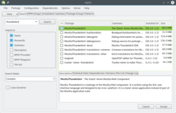

# 10. Installing Software

Software installation is generally incredibly easy on openSUSE. There's a package manager, which lets you install and remove packages very easily - it's comparable to the app stores found on many modern smart phones.

## 10.1 Using the package manager

Simply open YaST Software Management.

<video src="video/installpackage114.ogv" controls>  

<b>Your web browser does not support the HTML5 video element and/or Ogg Theora format. 
Try Firefox, Konqueror or Opera.</b>  

<a href="video/installpackage-full.ogv">Download video for local viewing (3.0 MB)</a>
</video>
  

Now search for the package you want, select it for installation and click Accept. The package manager will then fetch the RPM package from your configured software repositories - and install it including any dependencies. After installation is complete the application should appear in the launch menu (unless it's a command line program).

<table>
<tbody>
<tr>
<td></td>
<td>The availability of software packages in the package manager depends on the configured <i>software repositories</i>. Read about software repositories in the next chapter.</td>
</tr>
</tbody>
</table>

### 10.1.1 Using 1-click Installation

When browsing openSUSE related websites, you're likely to come across buttons such as this one:

1-click installation (also referred to as "Direct Install") simply automates the process of adding one or more software repositories to the package manager and installing one or more RPM packages. Therefore 1-click installation <i>should be used with the same care</i> as manually adding unofficial repositories (see the next chapter for more on software repositories). 

## 10.2 Other Installation Methods

Most users will find everything they need and more in the package manager - especially if a few additional software repositories are added (see next chapter). But not all software is packaged and provided via repositories, and non-free software usually can't be legally redistributed via the package manager because of license restrictions.

In these cases you'll need to go to the developer/vendor website and download and install the software manually - but <b>always</b> look for an openSUSE package in repositories first - and make sure you only download and install software from trusted sources.

### 10.2.1 RPM file

With a bit of luck the developer/vendor website will have an RPM file for openSUSE. To install a single, downloaded RPM file:

Open the Dolphin file manager =&gt; Navigate to the RPM file =&gt; Right Click it => Open With... => Install/Remove Software

<table>
<tbody>
<tr>
<td></td>
<td>Only install RPM files that are built specifically for (your version of) openSUSE.</td>
</tr>
</tbody>
</table>

### 10.2.2 Tarball

If the website doesn't have an RPM for openSUSE, it will most likely have a so-called <i>tarball</i>. Tarballs (*.tar.gz, *.tar.bz2) are simply compressed archives similar to ZIP and RAR files. To uncompress a tarball:

Open the Dolphin file manager =&gt; Navigate to the tarball =&gt; Right click =&gt; Extract Archive

The tarball might contain binaries that just need to be run, or it might contain source code which needs to be compiled to run on your system - this can be very complicated, and requires you to first install various developer tools. There's no one standard way to install tarball content, but instructions should always be included in the tarball in files called INSTALL, README or similar - or you should be able to find installation instructions on the website where you downloaded the tarball.

## 10.3 Package Management in the Terminal

If you wish, you can install and remove packages via a terminal too.

To search for a package run <i>zypper search [search term]</i>. Example:

zypper search thunder

To install a package run <i>zypper install [package name]</i>. Example:

zypper install MozillaThunderbird

To remove a package run <i>zypper remove [package name]</i>. Example:

zypper remove PackageKit

See <i>man zypper</i> for more.

man zypper

Or for help on indvidual commands use for example:

zypper install --help

### 10.3.1 Using 1-click in the Terminal

You can actually use 1-click installation in the terminal too, the syntax is <i>OCICLI [URL]</i>, Example:

OCICLI http://opensuse-community.org/nvidia.ymp

### 10.3.2 Manually downloaded RPM file

To install a manually downloaded RPM file, run:

zypper install /path/to/manually/downloaded.rpm

### 10.3.3 RPM Queries

You can get a lot of useful information about installed packages from the RPM database very easily.

Check which version is installed. Example:

rpm -q MozillaFirefox

List the files which are installed by a package, and where. Example:

rpm -ql amarok

Find out which package a certain file belongs to. Example:

rpm -qf /usr/bin/firefox

Get various information about a package, including changelog. Example:

rpm -qi --changelog MozillaFirefox

