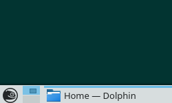

# 5. KDE Plasma Workspace

The KDE Plasma workspace is one of the first things you'll see when you boot openSUSE Leap for the first time. The desktop workspace consists of the desktop itself, menus, panels, file management and window management.

The KDE Plasma Workspace is very highly configurable. If there is something you don't like, you can almost certainly configure it to your liking. It is also extremely feature rich, mentioned below are just the most basic features.

## 5.1 The Desktop

The desktop is not very different from other desktop environments you may be familiar with - you have a panel on the bottom, a launch menu which is opened in the lower left corner.

However, a few things differ significantly from most other desktop environments:

- KDE uses _single click_ to open and launch things by default
- By default the applications you have running when you shutdown will be started again in the next session



### 5.1.1 The Launch Menu

The launch menu is opened by clicking the icon in the bottom left corner of the screen or pressing the Super key or Alt+F1. If you start typing a search field will appear on the top. You can add and remove applications to/from favourites by right clicking items in the menu.



You can edit menu entries or add new ones like this:

Right click the menu icon =&gt; Edit Applications...

To add a shortcut for an application on the desktop or in the panel you can do this (requires widgets to be unlocked):

Find the application in the menu => Right click the entry => Click "Add to panel" or "Add to desktop"

### 5.1.2 Virtual Desktops

To avoid your desktop getting cluttered with windows you can use virtual desktops to organize your applications and be more productive. In the panel you'll find a small grid, this is the desktop pager, use it to switch between your virtual desktops.

You can also use the desktop grid effect to get a big overview of your virtual desktops, try pressing _Ctrl+F8_ (requires desktop effects support, see the paragraph on this topic below).

## 5.2 File Management

The default file manager is Dolphin.You can find it as one of the favourites in the launch menu or in the "System" category. It should be very intuitive. USB sticks and other removable media will automatically appear in the left pane of Dolphin.

Launch Menu => System => Dolphin



## 5.3 Configure Desktop (KDE Systemsettings)

The global KDE settings are gathered conveniently in one place. Here you can configure almost anything related to the KDE Plasma workspace including mouse behaviour, default applications, file associations etc.

Launch Menu => Settings => Configure Desktop

You can also find Configure Desktop (systemsettings) as one of the favourites in the launch menu.





## 5.4 System Activity / Task List

Naturally KDE also has a tool to watch running processes and usage of system ressources. Simply press _Ctrl+Esc_ to bring up the system activity window.



For an advanced and customizable system monitor, including network graphs etc. run the program _ksysguard_

## 5.5 Widgets

The KDE Plasma Desktop is centered around widgets and containments. The desktop and the panel are containments in which widgets can be placed. The menu, the system tray etc. are simply widgets. Lots and lots of other widgets are available.

To add widgets:

Right click the desktop => Add widgets => Drag widgets to the desktop or panel

To configure, move, resize widgets etc., click to open the toolbox in the top right corner of the desktop. This requires widgets to be unlocked.

Right click the desktop => Either "Lock Widgets" or "Unlock Widgets".



## 5.6 Desktop Effects

The KDE window manager has built-in support for 3D desktop effects. A basic, unobtrusive selection of effects will be enabled out of the box if you have the proper hardware and driver support in place. Try pressing _Ctrl+F8_ or _Ctrl+F9_ for example.

You can disable or enable other/more effects in Systemsettings.



The keyboard shortcut to temporarily toggle desktop effects on/off is _Alt+Shift+F12_.
