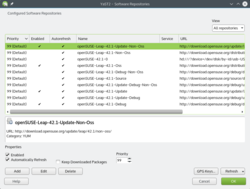

# 11. Software Repositories

As mentioned in the previous chapter, the package manager installs software by fetching packages from software repositories, therefore the software available for easy installation via the package manager depends on the configured repositories.

A software repository is a collection of RPM packages (the openSUSE packaging format) and metadata for the available packages. Usually repositories are on online servers, but it can also be on a CD/DVD or on other media.

## 11.1 Managing Repositories

Respositories can be added, removed and configured via YaST, in the module called Software Repositories.

### 11.1.1 Adding Repositories

The official repositories are pre-configured, but many unofficial repositories exist and can be added too.

<table>
<tbody>
<tr>
<td></td>
<td>Add repositories with care.
<ul>
<li>Unofficial repositories might include experimental packages</li>
<li>Not all repositories are mutually compatible</li>
<li>The risk level of a repository can change over time</li>
<li>Too many repositories makes the package manager slower</li>
</ul>
</td>
</tr>
</tbody>
</table>

The easiest and safest way to add repositories is using the list of online community repositories in YaST. This provides you with a selection of popular and quite safe repositories to choose from:

YaST => Software => Software Repositories => Click on "Add" => Select "Community Repositories" and click "Next"

Note that the <i>openSUSE BuildService</i> is a service for the community to build and share packages. <i>openSUSE BuildService repositories are unofficial and unsupported</i>. Use at your own risk.

### 11.1.2 Recommended Repositories

You should always have the four <i>official</i> repositories (which are configured out of the box). 

<ul>
	<li><b>Main Repository (OSS)</b></li>
	<li><b>Main Repository (NON-OSS)</b></li>
	<li><b>Main Update Repository</b></li>
	<li><b>Main Update Repository (NON-OSS)</b></li>
</ul>

Additionally I recommend adding the following <i>unofficial</i> repositories from the Community Repositories list, for having a good balance of software supply and stability for most users.

<ul>
	<li><b>Packman Repository</b></li>
	<!--<li><b>openSUSE BuildService - KDE:Extra</b></li>-->
</ul>

<table>
<tbody>
<tr>
<td></td>
<td>Still missing a package? You can search for packages/repositories on the openSUSE BuildService here: 
<a href="http://software.opensuse.org/" target="_blank">http://software.opensuse.org/</a></td>
</tr>
</tbody>
</table>

### 11.1.3 Vendor Change Updates

Updating installed packages from one repository to versions from a different repository with a different <i>vendor</i>, is a little bit complicated. Read about it here:

<a href="http://en.opensuse.org/SDB:Vendor_change_update" target="_blank">http://en.opensuse.org/SDB:Vendor_change_update</a>

## 11.2 Repository Management in the Terminal

If you wish, you can manage your repositories via a terminal too.

Add a repository with auto-refresh enabled <i>zypper addrepo -f [URL] [Alias]</i>. Example:

zypper addrepo -f http://ftp.gwdg.de/pub/linux/misc/packman/suse/openSUSE_Leap_15.3/ packman

Disable a repository <i>zypper modifyrepo -d [URL|Alias]</i>. Example:

zypper modifyrepo -d Packman

Remove a repository <i>zypper removerepo [URL|Alias]</i>. Example:

zypper removerepo http://ftp.gwdg.de/pub/linux/misc/packman/suse/openSUSE_Leap_15.3/

List configured repositories, showing  details (priorities, URL, etc.):

zypper repos -d

See <i>man zypper</i> for more.

man zypper

Or for help on indvidual commands use for example:

zypper addrepo --help

