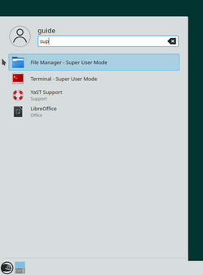
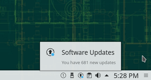

7. Security and Root

openSUSE and GNU/Linux in general is a very secure operating system, but when using any computer on the internet one should always be careful.  

7.1 The Root User

One of the reasons GNU/Linux is very secure is that you normally don't work with administrator permissions - only the root user has full administrative permissions.  

You'll be asked for the root password when installing packages or performing other administrative tasks outside of your /home/ folder. Unless you unchecked the checkbox during installation the root user has the same password as your normal user.  

<table>
<tbody>
<tr>
<td></td>
<td>Only work as root when it's required.</td>
</tr>
</tbody>
</table>

 

7.1.1 Super User File Manager

To work graphically with system files that require root permissions you can launch the Dolphin file manager in super user mode.
  

 

7.1.2 Working as Root User in the Terminal

The following command is used to switch to the root user in a terminal:

su -
 

<table>
<tbody>
<tr>
<td></td>
<td>Nothing will appear on the screen while you type your password. This is intended.</td>
</tr>
</tbody>
</table>

 

To stop working as root, enter the following command:

exit
 

To run a single command as root you can use:

su -c "[command]"
 

You can read more about using the terminal in the next chapter.  

7.2 Security Updates

When new updates are available you'll be notified by the update applet running in the system tray area.  

 

7.2.1 Installing Updates in the Terminal

To install official security and bugfix patches only, run:

zypper patch
 

To install official patches as well as updates from 3rd party repositories, run:

zypper update
 

7.3 Firewall

openSUSE comes with a firewall included in the default installation ('firewalld'). By default it allows all outgoing traffic and blocks any incoming traffic, hence you'll only need to change the configuration, if you want to run some network servers. The firewall is configurable in YaST, read about YaST in a later chapter.  

7.4 Virus and Spyware

There's no need to run a virus scanner or to scan for spyware. Malware spreading via the internet and infecting normal home user desktop systems are practically non-existant for GNU/Linux. Just make sure you yourself don't install and run software or scripts from untrusted sources, and you'll be safe.  
