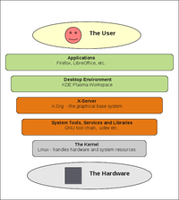

# Appendix C: Under the Hood

The purpose of this chapter is to give the reader a quick look and basic idea of what's going on beneath the surface of the openSUSE GNU/Linux operating system.  

## C.1 Main System Components

Any modern computer operating system is a very large and complicated contraption - and GNU/Linux distributions are no exception. The Linux kernel is just one of many components. The figure below shows the core components and what their respective roles are.  

<table style="text-align: left; width: 100%;" border="0" cellpadding="2" cellspacing="2">
        <tbody>
        <tr>
        <td style="width: 50%;">

 </td>
        </tr>
        <tr>
        <td class="image-caption">This figure shows the main components of a GNU/Linux operating system.</td>
        </tr>
        </tbody>
</table>

## C.2 File Tree

Most users will hardly ever need to work outside their home folder, but nevertheless it's probably a good idea to have a basic idea about the how the file hierarchy works.  

On GNU/Linux you only have <i>one</i> file tree, unlike e.g. Microsoft Windows which has a different file tree for each filesystem/partition - on GNU/Linux separate filesystems/partitions are <i>mounted</i> in folders within a single file tree. The root folder for the file tree is "<b>/</b>" and paths are written using forward slashes.  

So a path might look like this in GNU/Linux: 
<b>/home/<i>username</i>/Desktop/</b>  

In MS Windows a comparable path might look like this: 
<b>C:\Documents and Settings\<i>username</i>\Desktop</b>  

<table>
<tbody>
<tr>
<td></td>
<td>In GNU/Linux filenames and folders are <b>case sensitive</b>.</td>
</tr>
</tbody>
</table>

 

Normal users only have write permission in their <b>/home/</b> folder, and rarely have any need to work outside of that.  

## C.3 Hidden Files

Files and folders starting with '.' (dot) are hidden. You can make them visible in Dolphin file manager via the keyboard shortcut <b>Alt+.</b> or <b>View -&gt; Show Hidden Files</b> in the menubar.  

Applications store the user settings and data in hidden folders in the users home folder, e.g. <b>/home/<i>username</i>/.mozilla/</b> or <b>/home/<i>username</i>/.config/vlc/</b> etc. If you uninstall/reinstall an application the settings and data will remain in the home folder. To "reset" an application, you just rename or (re)move the settings and/or data hidden in your home folder.  

## C.4 Important Config Files

In GNU/Linux configurations and settings are usually stored in human-readable plain text files. Almost any configuration can be done graphically via YaST or various other GUI applications, but nevertheless it can be useful to know the location of some key config files.  

System wide configurations are mainly stored in <b>/etc/</b>, user settings are stored in hidden files in the home folder for the individual user.  

<table class="table">
<tbody>
    <tr>
    <td style="width: 230px;"><b>/etc/fstab</b></td>
    <td>The file system table, file systems/partitions mounted during boot.</td>
    </tr>
    <tr class="d1">
    <td style="width: 230px;"><b>/etc/sysconfig/yast2</b></td>
    <td>Configuration for YaST.</td>
    </tr>
    <tr>
    <td style="width: 230px;"><b>/etc/zypp/zypp.conf</b></td>
    <td>Configuration for the software management.</td>
    </tr>
    <tr class="d1">
    <td style="width: 230px;"><b>/etc/samba/smb.conf</b></td>
    <td>Samba configuration ("Windows Network")</td>
    </tr>
    <tr>
    <td style="width: 230px;"><b>/etc/HOSTNAME</b></td>
    <td>The hostname for the machine.</td>
    </tr>
    <tr class="d1">
    <td style="width: 230px;"><b>/etc/X11/xorg.conf.d/</b></td>
    <td>X-server configuration files. By default autodetection is used, edit these files if you must configure the X-server.</td>
    </tr>
    <tr>
    <td style="width: 230px;"><b>/etc/sysconfig/kernel</b></td>
    <td>The kernel. For example loading extra modules during boot.</td>
    </tr>
    <tr class="d1">
    <td style="width: 230px;"><b>/etc/modprobe.d/50-blacklist.conf</b></td>
    <td>Blacklisting kernel modules.</td>
    </tr>
    </tbody>
</table> 

## C.5 Logs

In case of problems it's good to know the location of the main log files, most are kept in <b>/var/log/</b>.  

<table class="table">
<tbody>
  <tr>
      <td style="width: 230px;"><b>/var/log/Xorg.0.log</b></td>
      <td>Log for the X-server.</td>
  </tr>
  <tr class="d1">
      <td style="width: 230px;"><b>/home/<i>username</i>/.xsession-errors</b></td>
      <td>Useful for troubleshooting applications ran as normal user.</td>
  </tr>
  <tr class="d1">
      <td style="width: 230px;"><b>/var/log/YaST2/</b></td>
      <td>Log files for various YaST modules and components.</td>
  </tr>
  </tbody>
</table> 

The main system log can be viewed with the YaST module <i>systemd-journal</i> or with the command journalctl:

journalctl
 

Read up on journalctl to use it effectively.  

## C.6 Troubleshooting

Here are some basic troubleshooting tips for GNU/Linux in case an application crashes or won't start at all.

<ul>
<li>If an application fails, try running it from a terminal to get more/better output</li>
<li>Try removing/renaming the hidden folder(s) for the application in the users home folder</li>
<li>Try creating a new user and see if the problem persists. If the problem does not persist for a new user, the cause can probably be found in the settings/data in the home folder of the user with the problem</li>
<li>Check out relevant log files</li>
</ul>

<table>
<tbody>
<tr>
<td></td>
<td>Reinstalling the software packages almost never solves anything, because the old settings and data will remain in hidden folders in the home folder.</td>
</tr>
</tbody>
</table>

 
